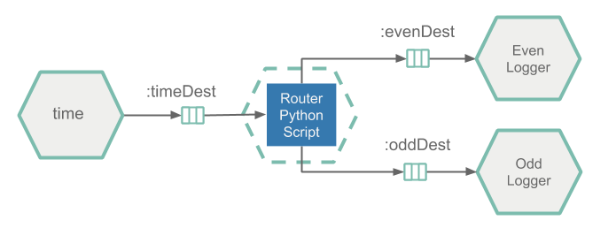
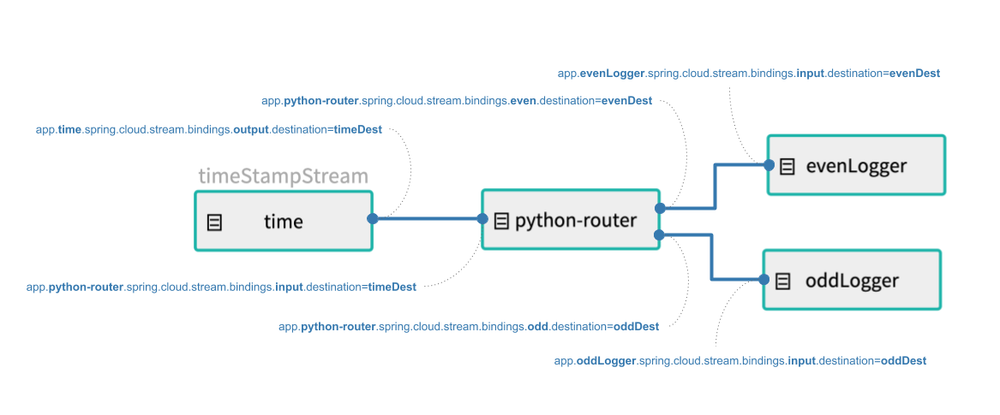

# Create and Deploy a Python Application

This recipe shows how to deploy a Python script as a Data Flow [application](https://docs.spring.io/spring-cloud-dataflow/docs/%dataflow-version%/reference/htmlsingle/#spring-cloud-dataflow-stream-app-dsl).
Unlike the other applications types (`source`, `processor`, or `sink`), Data Flow does not set deployment properties that wire up producers and consumers when deploying the `app` application type.
It is the developer’s responsibility to "wire up" the multiple applications when deploying, in order for them to communicate by using deployment properties.

The recipe creates a data-processing pipeline that dispatches `input` stream of timestamps to either `even` or `odd` downstream channels.
Technically, the recipe implements the [Dynamic Router](https://www.enterpriseintegrationpatterns.com/patterns/messaging/DynamicRouter.html) integration pattern.
The pipeline takes `timestamps` messages from an `timeDest` input channel. Depending on the timestamp value, it routes the message to one of the dedicated `evenDest` or `oddDest` downstream channels.

The following diagram shows the architecture of the data-processing pipelines:



As a timestamp source, the application uses the prebuilt [Time Source](https://github.com/spring-cloud/stream-applications/tree/v%streaming-apps-version%/applications/source/time-source) application but registers it as the Data Flow `App` type.
It continuously emits timestamps to a downstream Kafka topic called `timeDest`.

The `Router` app, implemented by the Python script and packaged as a Docker image, consumes the incoming timestamps from the `timeDest` Kafka topic and, according to the timestamp value, routes the messages downstream to either the `evenDest` Kafka topic or the `oddDest` Kafka topic.

The `Even Logger` and `Odd Logger` components are prebuilt [Log Sink](https://github.com/spring-cloud/stream-applications/tree/v%streaming-apps-version%/applications/sink/log-sink) applications but are registered as Data Flow `App` type.
Loggers consume the `evenDest` or `oddDest` topics and print the incoming message in on the console.

Apache Kafka is used as the messaging middleware.

## Development

You can find the source code in the samples GitHub [repository](https://github.com/spring-cloud/spring-cloud-dataflow-samples/tree/master/dataflow-website/recipes/polyglot/polyglot-python-app) and download it as a zipped archive: [polyglot-python-app.zip](https://github.com/spring-cloud/spring-cloud-dataflow-samples/raw/master/dataflow-website/recipes/polyglot/polyglot-python-app.zip).

The [python_router_app.py](https://github.com/spring-cloud/spring-cloud-dataflow-samples/blob/master/dataflow-website/recipes/polyglot/polyglot-python-app/python_router_app.py) implements the timestamp router application logic:

```python
from kafka import KafkaConsumer, KafkaProducer
from kafka.admin import KafkaAdminClient, NewTopic
from kafka.errors import TopicAlreadyExistsError

from util.actuator import Actuator
from util.arguments import get_kafka_brokers, get_env_info, get_channel_topic

class Router:

    def __init__(self, info, kafka_brokers, input_topic, even_topic, odd_topic):

        self.kafka_brokers = kafka_brokers
        self.input_topic = input_topic
        self.even_topic = even_topic
        self.odd_topic = odd_topic

        # Serve the liveliness and readiness probes via http server in a separate thread.
        Actuator.start(port=8080, info=info)

        # Ensure the output topics exist.
        self.__create_topics_if_missing([self.input_topic, self.even_topic, self.odd_topic])

        self.consumer = KafkaConsumer(self.input_topic, bootstrap_servers=self.kafka_brokers)
        self.producer = KafkaProducer(bootstrap_servers=self.kafka_brokers)

    def __create_topics_if_missing(self, topic_names):
        admin_client = KafkaAdminClient(bootstrap_servers=self.kafka_brokers, client_id='test')
        for topic in topic_names:
            try:
                new_topic = NewTopic(name=topic, num_partitions=1, replication_factor=1)
                admin_client.create_topics(new_topics=[new_topic], validate_only=False)
            except TopicAlreadyExistsError:
                print ('Topic: {} already exists!')

    def process_timestamps(self):
        while True:
            for message in self.consumer:
                if message.value is not None:
                    if self.is_even_timestamp(message.value):
                        self.producer.send(self.even_topic, b'Even timestamp: ' + message.value)
                    else:
                        self.producer.send(self.odd_topic, b'Odd timestamp:' + message.value)

    @staticmethod
    def is_even_timestamp(value):
        return int(value[-1:]) % 2 == 0


Router(
    get_env_info(),
    get_kafka_brokers(),
    get_channel_topic('input'),
    get_channel_topic('even'),
    get_channel_topic('odd')
).process_timestamps()

```

<!-- NOTE -->

If the `print` command is used inside the Python script, the output buffer must be flushed with `sys.stdout.flush()` to prevent it being filled up and causing disruption to the Kafka’s consumer-producer flow.

<!-- END_NOTE -->

- The [`kafka-python`](https://github.com/dpkp/kafka-python) library is used to consume and produce Kafka messages. The `process_timestamps` method continuously consumes timestamps from the input channel and routes the even or odd values to the output channels.

- The [`Actuator`](https://github.com/spring-cloud/spring-cloud-dataflow-samples/blob/master/dataflow-website/recipes/polyglot/polyglot-python-app/util/actuator.py#L7) class inside the [actuator.py](https://github.com/spring-cloud/spring-cloud-dataflow-samples/blob/master/dataflow-website/recipes/polyglot/polyglot-python-app/util/actuator.py) utility is used to expose operational information about the running application, such as health, liveness, info, and so on.
  It runs an embedded HTTP server in a separate thread and exposes the `/actuator/health` and `/actuator/info` entry points to handle the Kubernetes liveness and readiness probes requests.

- The [arguments.py](https://github.com/spring-cloud/spring-cloud-dataflow-samples/blob/master/dataflow-website/recipes/polyglot/polyglot-python-app/util/arguments.py) utility helps to retrieve the required input parameters from the command line arguments and environment variables.
  The utility assumes the default (that is, exec) [entry point style](https://docs.spring.io/spring-cloud-dataflow/docs/%dataflow-version%/reference/htmlsingle/#_entry_point_style_2).
  Note that Data Flow passes the Kafka broker connection properties as environment variables.

For the `python_router_app.py` to act as a Data Flow `app`, it needs to be bundled in a Docker image and uploaded to `DockerHub`. The following [Dockerfile](https://github.com/spring-cloud/spring-cloud-dataflow-samples/blob/master/dataflow-website/recipes/polyglot/polyglot-python-app/Dockerfile) shows how to bundle a Python script into a Docker image:

```docker
FROM python:3.7.3-slim
RUN pip install kafka-python
RUN pip install flask
ADD /util/* /util/
ADD python_router_app.py /
ENTRYPOINT ["python","/python_router_app.py"]
CMD []
```

The Dockerfile installs the required dependencies, adds the python script (`ADD python_router_app.py`) and utilities (under the `util` folder), and sets the command entry.

### Build

We now build the Docker image and push it to the DockerHub registry.

Checkout the [sample project](https://github.com/spring-cloud/spring-cloud-dataflow-samples) and navigate to the `polyglot-python-app` folder:

```bash
git clone https://github.com/spring-cloud/spring-cloud-dataflow-samples
cd ./spring-cloud-dataflow-samples/dataflow-website/recipes/polyglot/polyglot-python-app/
```

From within the `polyglot-python-app`, build and push the polyglot-python-app Docker image to DockerHub:

```bash
docker build -t springcloud/polyglot-python-app:0.2 .
docker push springcloud/polyglot-python-app:0.2
```

<!--NOTE-->

Replace `springcloud` with your docker hub prefix.

<!--END_NOTE-->

Once published in Docker Hub, the image can be registered in Data Flow and deployed.

## Deployment

Follow the [installation instructions](%currentPath%/installation/kubernetes/) to set up Data Flow on Kubernetes.

Retrieve the Data Flow URL from minikube (`minikube service --url scdf-server`) and configure your Data Flow shell:

```bash
dataflow config server --uri http://192.168.99.100:30868
```

Import the SCDF `time` and `log` app starters and register the `polyglot-python-app` as `python-router` of type `app`:

```bash
app register --name time --type app --uri docker:springcloudstream/time-source-kafka:2.1.0.RELEASE --metadata-uri maven://org.springframework.cloud.stream.app:time-source-kafka:jar:metadata:2.1.0.RELEASE

app register --name log --type app --uri docker:springcloudstream/log-sink-kafka:2.1.1.RELEASE --metadata-uri maven://org.springframework.cloud.stream.app:log-sink-kafka:jar:metadata:2.1.1.RELEASE

app register --type app --name python-router --uri docker://springcloud/polyglot-python-app:0.2
```

The `docker://springcloud/polyglot-python-app:0.2` is resolved from the [DockerHub repository](https://hub.docker.com/r/springcloud/polyglot-python-app).

Create the timestamp routing Stream pipeline:

```bash
stream create --name timeStampStream --definition "time || python-router || evenLogger: log || oddLogger: log"
```

<!--NOTE-->

The stream definitions shown earlier make use of the [label feature](%currentPath%/feature-guides/streams/labels/) in the DSL.

<!--END_NOTE-->

As a result, the following stream pipeline is created:


<!--IMPORTANT-->

The `time`, `log`, and `python-router` apps are registered as [App](https://docs.spring.io/spring-cloud-dataflow/docs/%dataflow-version%/reference/htmlsingle/#spring-cloud-dataflow-stream-app-dsl) type applications and, therefore, can have multiple input and output bindings (that is, channels). Data Flow does not make any assumptions about the flow of data from one application to another. It is the developer’s responsibility to "wire up" the multiple applications when deploying in order for them to communicate.

<!--END_IMPORTANT-->

Keeping this in mind, we deploy the timestamp stream pipeline with the deployment properties in the [polyglot-python-app-deployment.properties](https://github.com/spring-cloud/spring-cloud-dataflow-samples/blob/master/dataflow-website/recipes/polyglot/polyglot-python-app/polyglot-python-app-deployment.properties) file:

```bash
stream deploy --name timeStampStream --propertiesFile <polyglot-python-app folder>/polyglot-python-app-deployment.properties
```

The deployment properties defines the Kafka topics used to wire the time, python-router, and logger applications:

```
app.time.spring.cloud.stream.bindings.output.destination=timeDest

app.python-router.spring.cloud.stream.bindings.input.destination=timeDest
app.python-router.spring.cloud.stream.bindings.even.destination=evenDest
app.python-router.spring.cloud.stream.bindings.odd.destination=oddDest

app.evenLogger.spring.cloud.stream.bindings.input.destination=evenDest
app.oddLogger.spring.cloud.stream.bindings.input.destination=oddDest
```

<!-- NOTE -->

The app.python-router.xxx prefix is a Data Flow convention to map the properties specified after the prefix to the python-router app in the timeStampStream stream.

<!-- END_NOTE -->

The timestamp channel is bound to the `timeDest` Kafka topic. The router's even output channel is bound to the `evenDest` topic, and the odd channel is bound to the `oddDest` topic.
After the deployment, the data flow looks like this:



- Use the `kubectl get all` command to list the statuses of the deployed k8s containers. Use `kubectl logs -f xxx` to observe the even and odd pipeline output.

  For example, the `kubectl logs -f po/timestampstream-evenlogger-xxx` should output:

  ```bash
  2019-05-17 17:56:36.241  INFO 1 --- log-sink   : Even timestamp:05/17/19 17:56:36
  2019-05-17 17:56:38.301  INFO 1 --- log-sink   : Even timestamp:05/17/19 17:56:38
  2019-05-17 17:56:40.402  INFO 1 --- log-sink   : Even timestamp:05/17/19 17:56:40
  ...
  ```

  The `kubectl logs -f po/timestampstream-oddlogger-xxx` should output:

  ```bash
  2019-05-17 17:56:37.447  INFO 1 --- log-sink   : Odd timestamp:05/17/19 17:56:37
  2019-05-17 17:56:39.358  INFO 1 --- log-sink   : Odd timestamp:05/17/19 17:56:39
  2019-05-17 17:56:41.452  INFO 1 --- log-sink   : Odd timestamp:05/17/19 17:56:41
  ...
  ```
